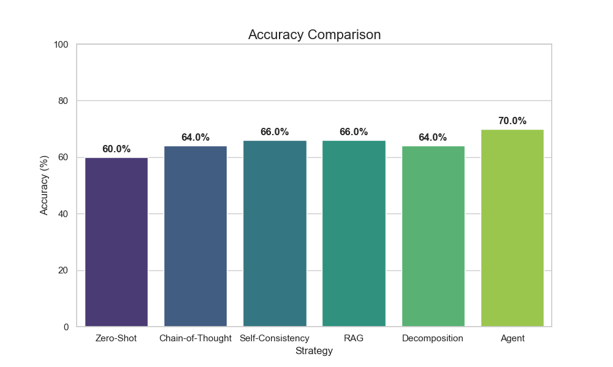

# Prompt engineering benchmark: FEVER dataset
LLMs are incredible at generating text, but they suffer from two major flwas when verifying facts: hallucinations (confidently stating falsehoods) and knowledge cutoffs (not knowing recent events).

> **Deep Dive:** In [this article](https://imartinezcuevas.github.io/posts/fact-checking-agent-prompt-engineering/), I explain the theory behind every technique and share my detailed learnings.

---
## Strategies Implemented
I have implemented and tested 6 distinct strategies to compare their performance:

| Technique | Description | Pros | Cons |
| :--- | :--- | :--- | :--- |
| **1. Zero-Shot** | Direct query to the model. | Fastest, cheapest. | High hallucination rate. |
| **2. Chain-of-Thought (CoT)** | "Let's think step by step." | Better logic/math. | Cannot fix missing knowledge. |
| **3. Self-Consistency** | Multiple CoT paths + Majority Voting. | More robust/reliable. | Higher compute cost (5x). |
| **4. Decomposition** | Breaking complex claims into sub-questions. | Handles multi-hop logic. | Complex prompt orchestration. |
| **5. RAG** | Retrieval *before* generation. | Provides context. | Static; can't recover from bad retrieval. |
| **6. ReAct Agent** | **Re**asoning + **Act**ing loop with Tools. | Autonomous, grounded, accurate. | Highest latency; complex implementation. |

### 📊 Results Snapshot


---

## Project structure
```bash
├── src/
│   ├── core/
│   │   ├── llm.py         # Local LLM Wrapper (Llama 3.1) 
│   │   ├── tools.py       # Search Tool definitions
│   │   ├── evaluator.py   # Accuracy metrics 
│   │   └── retriever.py   # Web Scraper (DuckDuckGo/Google/Wikipedia)
│   ├── pipelines/
│   │   ├── zero_shot.py        # Baseline
│   │   ├── cot.py              # Chain-of-Thought logic
│   │   ├── rag.py              # RAG
│   │   ├── self_consistency.py # ...         
│   │   └── decomposition.py    # ...
│   └── data/
│       └── loader.py       # FEVER Dataset loader
├── results/                # CSV Logs and Reports
└── requirements.txt
```

---

## **Local installation**

### 1. Clone the repository
```bash
git clone https://github.com/imartinez/prompt-engineering-benchmark-fever.git
cd prompt-engineering-benchmark-fever
```

### 2. Install dependencies
```bash
pip install -r requirements.txt
```

### 3. Run strategies
You can run specific pipelines as modules. For example, to run the ReAct Agent:
```bash
python -m src.pipelines.*
```